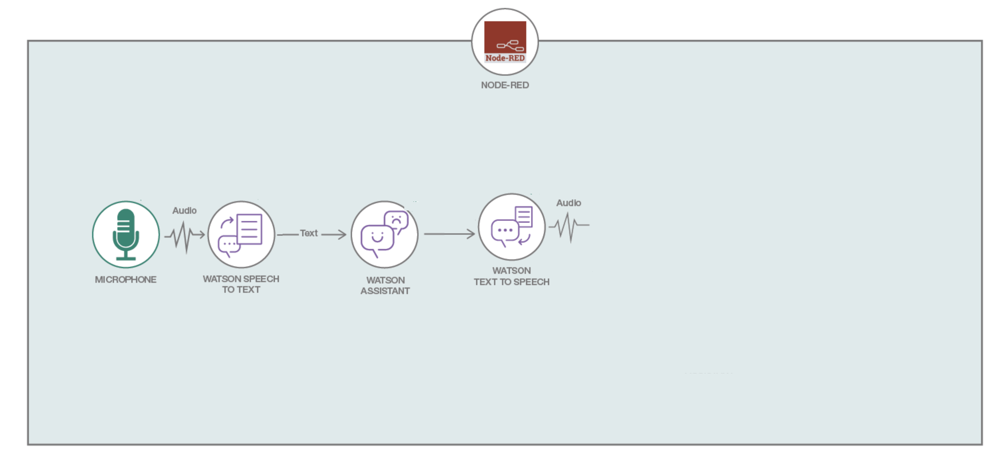

# Talk to your car: Power up your IoT app with AI 

## Introduction

With this project, you can quickly build a Node-RED Starter app and use the Watson cognitive services for audio conversations. You’ll use the Watson Assistant service  and its Car Dashboard Conversation workspace  as a starting point to building your conversation app. You can create or import your own conversation workspace, but using this provided one will get you started quickly.

This app records your speech, sends it to the Watson services to process the request. It can handle requests for the weather, or you can send commands and receive responses through a conversation to turn on the lights or play music. The possibilities are endless. Show us what you'll build.

## -- Before you begin --

* Create an IBM Cloud account if you don't have an existing one: [Sign up](https://ibm.biz/Bd2t6h).
* __Note__: All services used in this repo are Lite plans. Don't forget to star this repo if you like it.
* Use Firefox or Chrome for better performance

## Tutorial steps

Here a short [presentation](steps/presentation.pdf) of the components which you will make use of.

* Step 1 - [Create an IBM Cloud app using the Node-RED Starter application.](steps/nodered.md)
* Step 2 - [Deploy Speech-To-Text service from IBM Cloud Catalog.](steps/stt.md)
* Step 3 - [Deploy Tone Analyzer service from IBM Cloud Catalog.](steps/tone.md)
* Step 4 - [Deploy Assistant service from IBM Cloud Catalog.](steps/conversation.md)
* Step 5 - [Deploy Text-To-Speech service from IBM Cloud Catalog.](steps/tts.md)
* Step 6 - [Connect all the deployed services to the node-red starter application, which is created in step 1.](steps/connect.md)
* Step 7 - [Back to Node-RED Starter application (as in Step 1) and install extra microphone and audio nodes.](steps/microphone.md)
* Step 8 - [Import the flow and do some configuration.](steps/flow.md)
* Step 9 - [Done!! Now time to play with the flow ](steps/play.md)

> Make sure to have your device's microphone and speaker active for this project

## Useful links

* [IBM Cloud](https://bluemix.net/)  
* [IBM Cloud Documentation](https://www.ng.bluemix.net/docs/)  
* [IBM Cloud Developers Community](http://developer.ibm.com/bluemix)  
* [IBM Watson Internet of Things](http://www.ibm.com/internet-of-things/)   
* [IBM Watson IoT Platform Developers Community](https://developer.ibm.com/iotplatform/)
* [IBM Watson Tone Analyzer](https://console.bluemix.net/docs/services/tone-analyzer/index.html#tone-analyzer-endpoints)

## License
This code pattern is licensed under the Apache Software License, Version 2.  Separate third party code objects invoked within this code pattern are licensed by their respective providers pursuant to their own separate licenses. Contributions are subject to the [Developer Certificate of Origin, Version 1.1 (DCO)](https://developercertificate.org/) and the [Apache Software License, Version 2](http://www.apache.org/licenses/LICENSE-2.0.txt).

[Apache Software License (ASL) FAQ](http://www.apache.org/foundation/license-faq.html#WhatDoesItMEAN)
