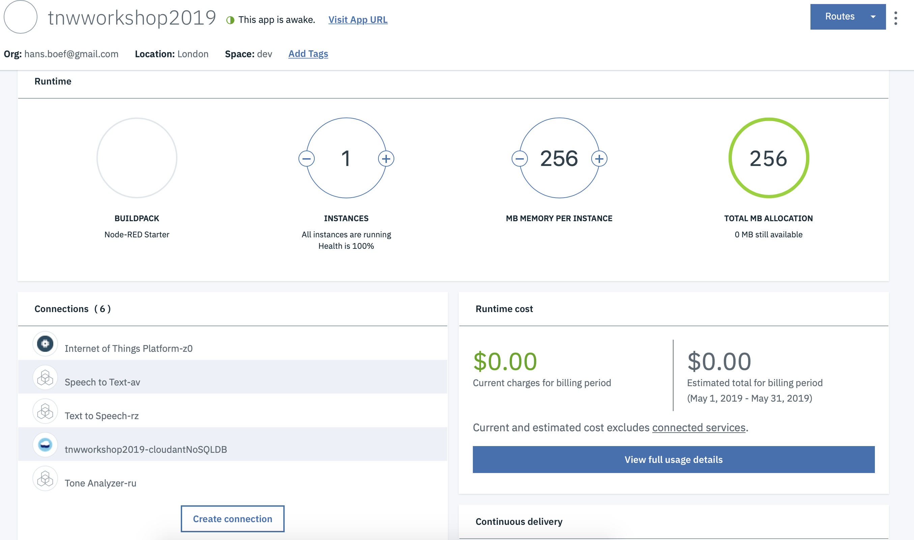

Go back to your Node-RED application and click on create connection. Then select one by one, the deployed services. Leave all settings default. You don't need to restage every time, you can do that whne all services are connected.

